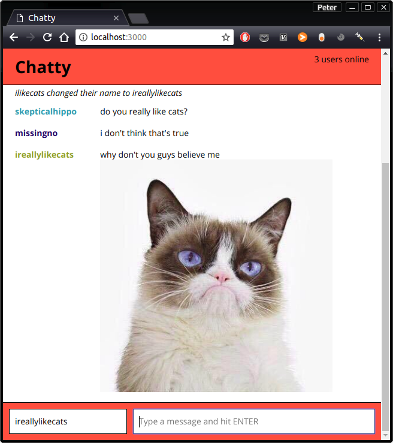

# Chatty - Chat client
A simple chat app built as a React SPA, using WebSockets. Chatty allows users to send messages, change their display name, and send images.

This project began as an assignment for Lighthouse Labs web development bootcamp, as a way to learn React and WebSockets.

## Features
### Client-side
- send messages via websockets
- change display name
- send images by pasting a valid image URL
- see how many users are online

### Server-side
- broadcast messages and notifications to all connected clients
- randomly generate a display color for each connected client

## Screenshots


## Getting Started
- clone the repository and install dependencies. Note that the server files are located within the client folder, and needs to be installed separately:
```
$ npm install
$ cd server
$ npm install
$ cd ..
```
- Run the client:
```
$ npm run client
```
- Run the server in a separate terminal window:
```
$ npm run server
```

## Usage
- Navigate your browser to `http://localhost:3000`
- You can send messages (including image URLs), or change your display name
- Try opening the page in multiple tabs!

## Issues
- message list area does not scroll to bottom on receiving new message